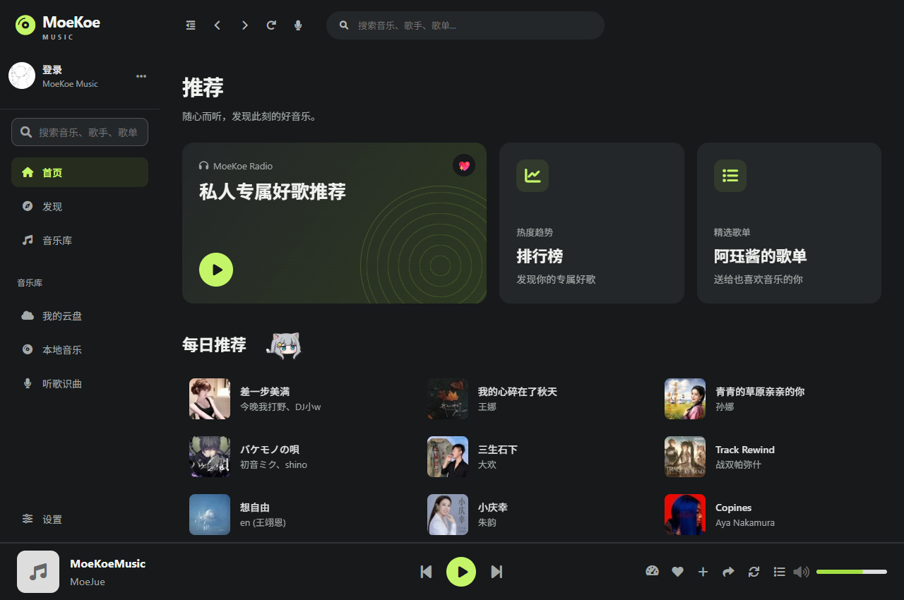
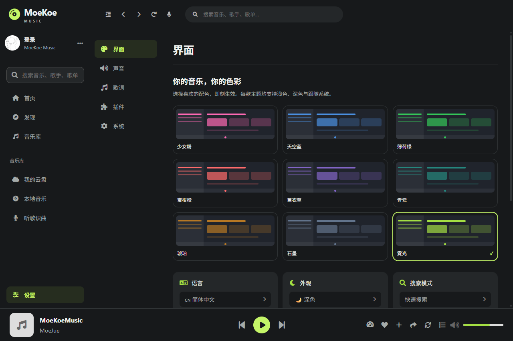
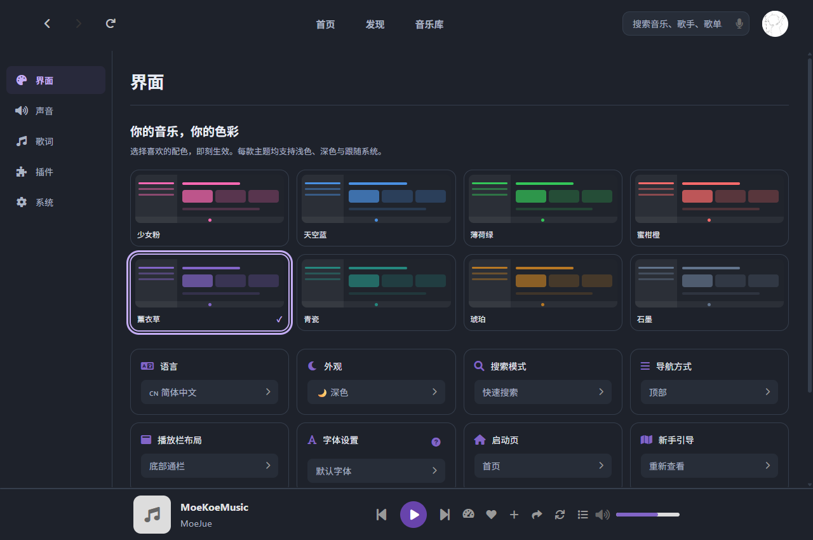
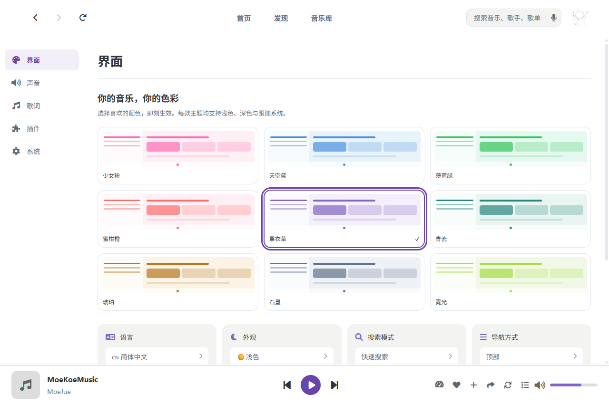
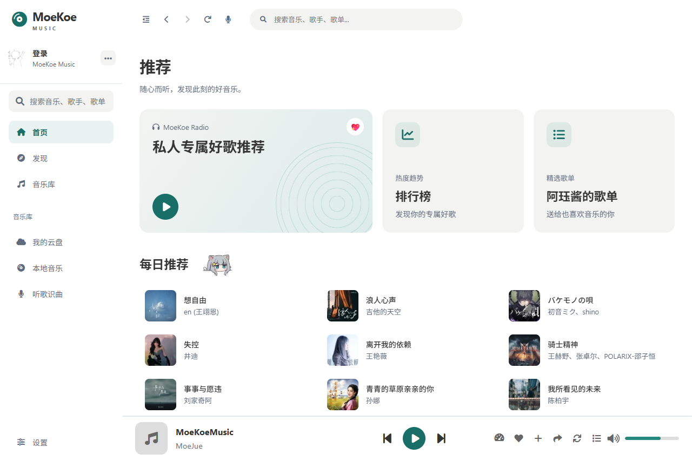

# UI 与主题更新

基于上游 `b974ff5`（1.7.0），本次调整展示与主题设置，保留播放、搜索、账号、歌单、下载、API、插件和原生窗口控制功能。参考汽水音乐 PC 端的深色侧栏、封面内容与少量高亮色，沿用 MoeKoe 的品牌和交互。导航、中间内容和底部播放器使用连续背景，设置页取消外层卡片，保留内部控件分组。

## 使用

打开「设置 → 界面」，直接选择主题预览。保留原有粉、蓝、绿、橙，新增薰衣草、青瓷、琥珀、石墨和霓光，共 9 款配色。所有配色支持「外观」中的浅色、深色和跟随系统，立即保存，无需重启。顶部／侧边导航、播放器布局、字体选择和原有设置仍可使用。

未保存外观偏好时默认使用「霓光 + 深色 + 侧边导航」，首页默认采用图标推荐卡片。已有明确保存的选择继续生效；点击首页「推荐」标题，仍可切回原来的插画推荐卡片。侧栏底部增加设置入口，顶部搜索框始终展开。

主题使用原来的 `settings.themeColor` 和 `theme` 存储，不需要迁移。新增配色名称和说明覆盖简繁中文、英文、日文、韩文及俄文。








## 实现与兼容性

- 复用现有 Vue、SCSS 和设置动作，未增加依赖、未升级锁文件。
- 原有配色变量保持兼容；新增可读性更好的文字强调色及共享背景变量。
- 去掉深色模式作用于整个 HTML 的亮度滤镜，避免封面变暗和固定定位被滤镜影响。
- 复用同一个系统主题媒体查询对象，保证切换到手动模式后真正解除原来的监听器。
- 主题选择使用原生单选框，可用 Tab 和方向键操作；设置分类使用原生按钮，设置卡片支持键盘激活。
- 支持系统减少动画偏好、强制颜色下的主题选择标记；设置区域有可见滚动条。
- 主应用背景只应用于 HomeLayout，避免污染单独的桌面歌词透明窗口。
- 深色页面复用统一表面颜色；登录按钮区分高亮、文字和禁用状态。窄窗口播放器保持封面宽度，歌曲标题按可用空间省略，保留全部操作。
- 保留现有桌面最小窗口限制；额外检查 760px Web 窗口。未将本桌面项目改造为完整手机应用。

## 验证记录（2026-09-27）

Windows 上使用仓库锁定的 Electron 39.2.4：

- `npm run build`：通过，生成生产资源和 PWA service worker。
- `npx electron tests/ui-smoke.cjs`：通过。使用独立的内存会话与隐藏的离屏窗口，不读取实际用户账号。
- 覆盖 9 配色 × 浅深色、通过实际设置控件切换、刷新后恢复、原生方向键操作、跟随系统与退出跟随系统。
- 覆盖 1280 / 960 / 760 窗口，主题卡片、播放器与封面边界；额外检查 890px 桌面最小宽度下右侧对齐播放器的按钮边界与封面尺寸。
- 覆盖侧栏折叠／展开、账号菜单定位、设置入口、首页／发现／登录页导航、登录按钮颜色、首次使用默认外观、推荐卡片样式切换。
- 播放队列／速度菜单可打开关闭；6 种语言的主题文案和减少动画样式通过检查。
- 人工查看浅深色、窄窗口、侧栏、首页、发现页和登录页截图。
- `git diff --check`：通过。

复现方式（推荐 Node 24 LTS；当前系统 Node 26 对 Electron 安装解压出现异常，使用 Node 24 安装成功）：

```sh
npm ci
git submodule update --init --recursive
npm install --prefix api --no-package-lock
# 分别在独立终端运行：
node api/app.js --platform=lite --port=16521
npm run serve -- --host 127.0.0.1
npx electron tests/ui-smoke.cjs
```

测试截图默认保存到系统临时目录的 `moekoe-ui-smoke`，可通过 `UI_TEST_OUTPUT` 指定目录。测试脚本依赖开发服务器提供模块，用于运行期检查；生产产物另经构建验证。

边界：未登录真实酷狗账号，因此未宣称验证付费歌曲、账号认证或云盘写入；未在 macOS/Linux 实机测试、未生成这两个平台的安装包。原版构建也存在 `head.png` 路径提示、大于 500KB 的主包提示和浏览器数据库过期提示，本次未升级依赖或改变这些功能相关配置。

## Windows 安装包（v1.7.1）

[下载 Windows x64 安装包](https://github.com/toddtuijk-maker/MoeKoeMusic/releases/download/v1.7.1/MoeKoe_Music_Setup_v1.7.1-x64.exe)，或在 [Release 页面](https://github.com/toddtuijk-maker/MoeKoeMusic/releases/tag/v1.7.1) 下载 SHA-256 校验文件。已内置 Electron 与 API，无需另装 Node.js。本次提供 x64：API 子模块本身使用 x64 构建目标，故不再生成带 x64 API 的错误 32 位安装包。安装包未做代码签名。

版本号、安装完成页、应用更新源和更新对话框均指向本 fork 的 v1.7.1 发布，防止更新时混入上游原版。保留上游作者署名和许可证。

验证：NSIS 安装器在独立目录静默安装返回 0；安装后的程序从本地 `app.asar` 加载，Electron IPC、默认霓光深色侧栏、9 款主题与主题保存正常；内置 API `/top/card` 返回 `error_code: 0`；卸载返回 0，测试目录的程序已移除。另对相同打包产物验证真实鼠标输入可跳过新手引导并切换主题。测试使用独立临时用户配置，不登录真实账号。

使用 Node 24，在前述依赖安装完成后复现：

```sh
npm run build
npm run electron:build:win
# 对安装后的程序执行检查，参数替换为实际安装路径：
node tests/installed-smoke.cjs "C:/path/to/MoeKoe Music.exe"
```

安装器、`.blockmap` 和 `latest.yml` 上传至 GitHub Releases；二进制不放入 Git 历史。校验文件的 SHA-256 对应安装器：`7aad5f81d1087b5a2bdd5167d99aa650b98439d42234488d12b6d0dbcb157eb2`。

## 调研依据

核对了仓库 README、各语言说明的结构与平台说明、贡献／安全指南、构建脚本、API 子模块说明、最近提交、发布记录与公开问题，并追踪设置存储、主题应用、布局、歌词窗口和播放器样式调用。

- [上游项目](https://github.com/MoeKoeMusic/MoeKoeMusic)
- [1.7.0 发布记录](https://github.com/MoeKoeMusic/MoeKoeMusic/releases/tag/v1.7.0)
- [官方项目说明](https://music.moekoe.cn/)
- [官方字体设置说明](https://music.moekoe.cn/guide/font-settings.html)
- [汽水音乐官方页面](https://music.douyin.com/qishui)：核对官方 PC 端入口。
- [360 软件宝库的汽水音乐 PC 页面](https://baoku.360.cn/soft/show/appid/2000006752?channel=4021700)：参考公开界面截图的布局、色调和内容层级，未复制品牌标识或插画素材。

官方 changelog 页面读取超时，更新信息以 GitHub Release 与提交记录为准。
